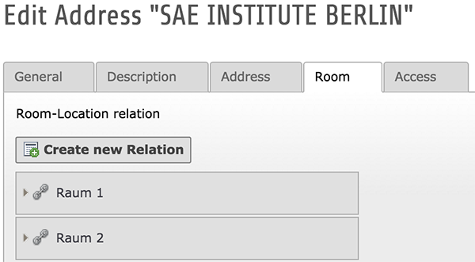

# TYPO3: Event Management Extension (eventmgmt)

* EXT: Event Management
* Extension Key: eventmgmt
* Language: en
* Version: 1.0.0
* Keywords: calendar, events, conference, management, typo3, extension
* Copyright 2006-2016, [undkonsorten.com](http://www.undkonsorten.com)

---

## Table of Contents
* [What does it do?](#what-does-it-do-)
* [Screenshots](#screenshots)
* [Short Manual](#short-manual)
* [Manual](#manual)
  * [Installation](#installation)
  * [Setting up your first event](#setting-up-your-first-events)
  * [Calendar](#calendar)
    * [Timeslots](#timeslots)
  * [Events](#events)
  * [Categories](#categories)
  * [Locations](#locations)
  * [Plugin Settings](#plugin-settings)
    * [Views](#views)
  * [Administration](#administration)
    * [TypoScript](#typoscript)
    * [Extension Manager](#extension-manager)
    * [BE-User settings](be-user-settings)
* [To Do](#to-do-%2f-backlog)
* [License](#license)

---

## What does it do?

The TYPO3 **Event Management (eventmgmt)** extension for handling **calendars** and **events** or **conferences**.

It can be used to show events that happen over the year or also to handle a conference with days, timeslots, locations and rooms.

The events can be **searched** and **filtered** in the frontend by (two) categories. Together with the extension Addressmgmt it can as well handle **speakers**, **organizers**, **contact persons** and **geo locations**. Frondend users are also able to edit their own events.

### TYPO3 Event Management can handle
* events
* (multiple) calendars
* (multiple) categories for filtering and displaying
* speakers
* organizers
* contact persons
* locations
* locations with multiple rooms
* timeslots

### Eventmgmt has the following views
* upcoming events (List and ShortList)
* past events (archive)
* all events (useful for a conference where you do not want the events to disappear)
* events by calendar (upcoming??)
* events by speaker

Most of the views come along with a built in search and filter option.

## Screenshots

#### List view with filters for naturschutzfonds.de


---

#### List view with filters for [regionen-mit-peb.de](http://www.regionen-mit-peb.de/veranstaltungen/)


---

#### List view with search and filters for [chorfest.de](https://www.chorfest.de/programm/)


---


## Short Manual

This are the most important steps to make the Extension Eventmgmt running in 3 minutes:

* [Install](#installation) the extensions Addressmgmt and Eventmgmt
* Include the static TypoScript templates for
  * Addressbook (addressmgmt)
  * Event (eventmgmt)
  * EventBasisCss (eventmgmt)
* Create a TYPO3 SysFolder for the events. There
  * create a [calendar](#the-calendar)
  * create an event
* Insert on your page the new content element [Plugin](#plugin-settings)  plugin with the Type *Event Management*

If you have any problems, please [let us know](http://undkonsorten.com/kontakt_.php).

---

## Manual

### Installation

* Get the extensions **Addressmgmt and Eventmgmt** from the TYPO3 extension manager, Composer or clone it from GitHub
* **Dependencies**: Addressmgmt

### Setting up your first events

To set up the first events create in a SysFolder

* a new calendar (because every event need a calendar)
* a new event

### Calendar

Each event can have only one calendar (required field).
Multiple **[timeslots](#timeslots)** can be connected to the calendar.

#### Backend: Calendar Item


---

#### Timeslots

Timeslots can be created within the calendar. The define a begin and end end time of the slot.

The frontend view *"List: by Timeslots"* will display all the available timeslots of the calendars which are selected in the plugin.

### Events

And event dataset has realations with
* one calendar (required field)
* (multiple) categories (for filtering and displaying)
* speakers
* organizers
* contact persons
* locations / locations with multiple rooms


### Categories

Create parent categories (TYPO3 SysCategories) for your calendar if needed (e.g. 1: Events Topics, 2: Event Types)

If you want to use the **categories for filtering** the events in the frontend you also have to set the values for this parent categories in the TypoScript constants with the TYPO3 Constant Editor.

<pre>
plugin.tx_eventmgmt.settings.category.typeUid = 1
plugin.tx_eventmgmt.settings.category.regionUid = 2
plugin.tx_eventmgmt.settings.category.topicUid = 3
</pre>

Create categories like (1.1: TYPO3, 1b: WordPress, 1.2: GitHub; 2.1: Panel, 2.2: Workshop ...) as a child of the topic and/or event type categories

If you need also create a parent category for display categories (e.g. Public Events, Internal Events).

Edit the constants. Take care you set the PIDS right. Otherwise filtern and internal links (e.g "Show all events in this location") will not work.

**Normal Categories** are the ones that are shown in the Frontend (e.g. Topics like politics, history or event types like Workshop, Lecture). They can be used as Filters in the Frontend (e.g. filterbox) and in the Plugin as a filter to show/not show in the list.

**Display Categories** are not shown in Frontend and can be used as filters in the plugin only. That means the are just used to show/hide certain events from the list views.

If you set in the Plugin show/hide categories (in List), the plugin is checking the the *Normal Categories* **and** *Display Categories*.

* plugin.tx_eventmgmt.settings.category.topicUid =
* plugin.tx_eventmgmt.settings.category.regionUid =


* Create "noramal" thematical categories (e.g. "workshop", "speach" or also regional ones like "Berlin, Hamburg") and
* Dispay categories: if needed also the so called "display categories" (e.g. Microsite 1, Microsite 2). Dispay categories can be used later to show events from diffent calendars in diffenent places/domains on the TYPO3-Installations. The won't be seen in the Frontend.

### Locations

Eventmgmt provides 3 different types to edit your event locations. You can...
* 1: either just use the textarea "Location Alternative" for easy copy pasting
* 2: use a relation to and the Addressmgmt table (type: location) or
* 3: use a the location-room-relation (if you have a location with many rooms)

You can switch the available location fields available for the editors by including the XXX PageTs or by the settings in the Extension Manager (@Todo !) or hide the excludefields by PageTs, UserTs or user settings.

#### Location-Room-Relation


---

With the location room relation you first create a location (e.g. TU Berlin, FU Berlin) and add rooms to this location. This is a bit tricky for the editors.

Rooms can be also directly added to Address items with the type *location* (see image below).

##### Address with multiple rooms



---

#### Location as address item (without rooms)

If you events happen always on different places it is better to use the second option – an **relation between the event and an Address item**. The "Location Alternative" can be still used to define the room as an additional information.

#### Location Alternative/Additional field


The content of the **Alternative/additional location** field will always be shown in the Frontend. It can also by used by lazy editors for copy pasting the address or additional information.

## Plugin settings

For proper working of the TYPO3 Event Management extension you need to install at least on list view.

If you also need views for speakers and locations you have to use the plugin Adressmgmt.

### Views

The Event Management Plugin has the following views

#### Shortlist: upcoming events


---

This template shows all the upcoming events. It does not provide a search and filter functionality. This view could be used for example for a homepage to show the upcoming 5 events.


#### List: all upcoming


This template would be used for the main events page of your website. It can comes along with a search and filter functionality.

#### List: archive/past events

This list can be used for past events as an event archive. I also comes along with a search and filter functionality.

#### List: by Timeslots

This view provides a (cached) filter for timeslots (see below)


---

#### Detail view

This view **can** be used for displaying the single event. But also the list templates are able to display a singl event.

#### Other views

* List: upcoming events grouped by calendar
* List: all events
* List: all calendars
* List: by speaker

## Administration

Settings for the Events Management Plugin can be found
* in the Extension Manager
* in the Constant Editor (TypoScript Constants)
* via PageTS
* via TypoScript-Setup
* in the Plugin (Flexforms)

### TypoScript

Do not forget to include the static TypoScript templates:
* Addressbook (addressmgmt)
* Event (eventmgmt)
* EventBasisCss (eventmgmt) – optional for basic styling

Since the template is build with Fluid you can also create you own templates and updating your template via the Constant Editor > PLUGIN.TX_EVENTMGMT (see below).


Most of the constants are self explaining. 
But there are some constants we might need to explain.

#### Uid's for categories

This constants are used for the filters in the list view with searchbox. 
If the constants for the categories are not set, no filter categories will be displayed.

##### plugin.tx_eventmgmt.settings.category.typeUid

This is the uid of the parent category (e.g. *Eventmgmt_EventTypes* ) for event types (e.g. Congress, Meeting, Excursion). 


##### plugin.tx_eventmgmt.settings.category.topicUid

This is the uid of the parent category (e.g. *Eventmgmt_EventTopics* ) for event topics (e.g. Politics, Economics). 


##### plugin.tx_eventmgmt.settings.category.regionUid

This is the uid of the parent category (e.g. *Eventmgmt_EventRegions* ) for event regions (e.g. Germany, France, Poland). 


#### Others

##### plugin.tx_eventmgmt.settings.search.fields

This are that fields that will be respected in the search.

By default the ```title``` is set as a search field. 
You can also set ```category.title```.

### Use content elements in events

You can add content elements to event data. On using this feature, it's possible that some columns are not rendered in frontend. Maybe they are missing in Content Model of eventmgmt. You have to add those columns in your own model which extends the eventmgmt Model. You can do this with an own extension. Maybe a sitepackage or similar. Two files are needed:

1. Your own Model Class. Create a php file: `Classes/Domain/Model/Content.php`

    
    <?php
    namespace Undkonsorten\ThemeUk\Domain\Model;
    class Content extends \Undkonsorten\Eventmgmt\Domain\Model\Content
    {
        /**
         * @var string
         */
        protected $yourField;
    
        /**
         * @return string
         */
        public function getYourField(): string
        {
            return $this->yourField;
        }
    
        /**
         * @param string $yourField
         */
        public function setYourField(string $yourField): void
        {
            $this->yourField = $yourField;
        }
    }

2. Create a file: ext_typoscript_setup.txt in your extension root folder


    config.tx_extbase {
      persistence {
        classes {
          Undkonsorten\ThemeUk\Domain\Model\Content {
            mapping {
              tableName = tt_content
              columns {
                your_field.mapOnProperty = yourField
              }
            }
          }
        }
      }
      objects {
        Undkonsorten\Eventmgmt\Domain\Model\Content.className = Undkonsorten\ThemeUk\Domain\Model\Content
      }
    }

---


### Extension Manager

The Extension Manager provides the following settings for the Eventmgmt extension:
 * Uid of display [categories](#categories) [basic.displayCategory]
 * Uid of normal [categories](#categories)  [basic.normalCategory]

 * IRRE for registration link [basic.inlineForRegister] (if not set you could forward to your contact form)
 * Use FeUser as person relation [basic.feUserAsRelation] (instead of Adressmgmt, needed for frontend editing of events)
 * Deactivate automatically tinymcE JS loading [basic.deactivateTinyMceJs] (tinymcE is only need for frontend editing for events with RTE)


### BE-User settings

For using the Event Management extension you have to set the following rights to you BE Users:

* Address (DE: Adresse)
* Social Identifiers (DE: Soziales Netzwerk)
* Link (DE: Internetseite)
* Relation (Location/Room-Relation)
* Room
* Calendar
* Event
* Maybe: Timeslots

Do not to forget to set also the "Page Content Plugin Options eventmgmt_list" and addressmgmt. Otherwise the BE-User can not set the Plugin Filter Categories


## FE User vs Addressmanagement

* Beachte: Hat auch Auswirkungen auf die Templates, wenn der Speaker ein FEUser oder Addresse ist
* Wir haben den Link auf die Einzelansicht Speaker gerade für den FE-Manager in Template gebaut
* Auch ben den Searchfields muss man den die passenden PropertyName einstellen (z.B. speakerFeUser.name bzw. speakerAddress.name)


## To Do / Backlog

We still have a lot of features in mind. For now we would like to have the following features:

* im Template FE-User/AdressSwitch nachvollziehen
* select address>location outomaticly instead of person/organisation (creates bugs)

As long as no client needs this features we are hoping for your sponsoring. Please contact us if you need any features.


## License

This extension is published under the Open Content License
available from http://www.opencontent.org/opl.shtml

The content of this document is related to TYPO3
- a GNU/GPL CMS/Framework available from www.typo3.org
